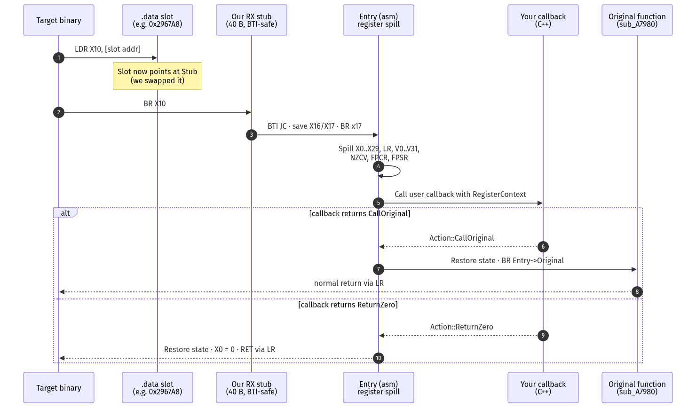
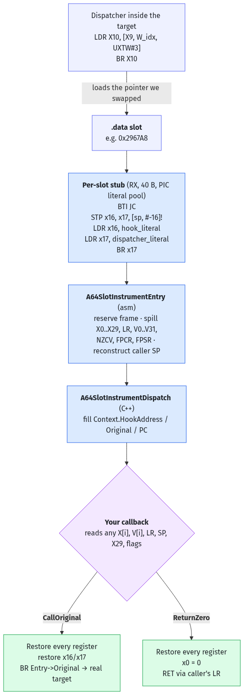

<div align="center">

# A64SlotInstrument

**AArch64 instrumentation for writable function-pointer slots — hook obfuscated indirect-branch dispatch without touching `.text`.**

[](LICENSE)
[](#platform-support)
[](CMakeLists.txt)
[](#threading-model)
[](#how-it-works)

</div>

---

A64SlotInstrument swaps a single `.data` function-pointer slot for a per-slot
executable stub, captures the full ARM64 register file at the call boundary,
and hands it to your C++ callback. The target's `.text` is never modified.

This library is **not** an inline-hook engine — if you need to patch arbitrary
already-linked code, use [Dobby](https://github.com/jmpews/Dobby) or
[bytedance/android-inline-hook](https://github.com/bytedance/android-inline-hook).
A64SlotInstrument is deliberately smaller and solves one problem: **hooking
obfuscated routines whose basic blocks are chained through a `.data` dispatch
table and an indirect `BR Xn`.**

## Table of contents

- [Features](#features)
- [What you can hook](#what-you-can-hook)
  - [Case 1 — normal slot replacement](#case-1--normal-slot-replacement)
  - [Case 2 — obfuscated indirect-branch dispatch](#case-2--obfuscated-indirect-branch-dispatch)
- [How it works (mental model → sequence → details)](#how-it-works-mental-model--sequence--details)
- [Platform support](#platform-support)
- [Build](#build)
- [Quick start](#quick-start)
- [Examples](#examples)
- [API reference](#api-reference)
- [Captured register state](#captured-register-state)
- [Threading model](#threading-model)
- [To do](#to-do)
- [Project layout](#project-layout)
- [Testing](#testing)
- [License](#license)

## Features

| | |
|---|---|
| **No code patching** | Only the `.data` slot is updated, with a release-CAS. The target function's instructions are untouched. |
| **Full register snapshot** | Callback receives `X0..X29`, `LR`, `SP`, `PC` of the stub, `NZCV`, `FPCR`, `FPSR`, and all 32 128-bit `V[0..31]` SIMD/NEON registers. |
| **BTI-safe stubs** | Each stub starts with `BTI JC`, so slots reached by indirect `BR` on BTI-enabled targets land cleanly. |
| **PIC literal pool** | The hook pointer and the dispatcher entry live inside the stub itself — no ABS64 relocation, no runtime linker involvement. |
| **Allocation-free hot path** | The callback path takes no mutex and does no heap work. |
| **Signature-agnostic** | Because the whole register file is forwarded, the framework does not need to know the target's C/C++ signature. |
| **Shortcut-return** | `Action::ReturnZero` restores register state, clears `X0`, and returns to the caller without executing the original. |

## What you can hook

Anywhere a function pointer **sits in RW memory and gets dialed through an
indirect branch** — that's a slot you can replace. The library is useful
for two very different jobs. The second one (obfuscated dispatch) was the
original motivation, but the first one (plain callback tables) is just as
practical and much easier to explain.

### Case 1 — normal slot replacement

The everyday case: a C or C++ program keeps a **table of callbacks** in a
global, and some loop later reads one of them and calls it. Audio engines,
scripting bridges, plugin registries, game-engine update loops, and
C-style vtables all look like this.

Imagine an audio engine with a global effects table:

```cpp
struct AudioEffect {
    const char *Name;
    void (*Process)(float *Samples, size_t Count);   // <-- the slot
};

static AudioEffect Effects[] = {
    { "reverb",     ReverbProcess     },
    { "distortion", DistortionProcess },
    { "lowpass",    LowpassProcess    },
};
```

When the mixer wants to run `reverb`, the compiler emits something like
this at the call site:

```asm
; AArch64 call site inside the mixer:
ADRP   X8,  Effects@PAGE            ; address of the table
ADD    X8,  X8, Effects@PAGEOFF
LDR    X9,  [X8, #8]                ; load .Process (the SLOT) → X9
MOV    X0,  SamplesPtr              ; arg0: float *Samples
MOV    X1,  SamplesCount            ; arg1: size_t Count
BLR    X9                           ; indirect call — ENTERS OUR STUB
```

Hook that slot with one line:

```cpp
static A64SlotInstrument::Action OnReverbProcess(
    const A64SlotInstrument::RegisterContext &Ctx)
{
    float  *Samples = reinterpret_cast<float *>(Ctx.X[0]);
    size_t  Count   = static_cast<size_t>(Ctx.X[1]);

    float Peak = 0.0f;
    for (size_t i = 0; i < Count && i < 64; ++i) {
        float a = Samples[i] < 0 ? -Samples[i] : Samples[i];
        if (a > Peak) Peak = a;
    }
    LastReverbPeak = Peak;       // observe the audio without blocking it
    ReverbCallCount++;

    return A64SlotInstrument::Action::CallOriginal;  // let reverb run
}

void InstallReverbMonitor()
{
    // &Effects[0].Process is the writable function-pointer slot.
    A64SlotInstrument::Instrument(
        reinterpret_cast<uintptr_t>(&Effects[0].Process),
        OnReverbProcess);
}
```

What you get for free:

- Every integer / pointer arg via `X[0..7]`.
- Every floating-point / vector arg via `V[0..7]` (`float`, `double`, and
  SIMD lanes).
- The caller's `LR`, `SP`, and `X29` for a one-shot backtrace.
- Full status registers (`NZCV`, `FPCR`, `FPSR`) so you can tell whether
  the call raised an IEEE exception while you were watching.
- A clean `ReturnZero` to short-circuit the call entirely (handy for
  disabling a feature at a seam without recompiling).

> [!TIP]
> If your target is C++ and the vtable happens to live in RW memory, the
> same trick hooks a virtual method call. Many engines generate per-object
> vtables at runtime (ECS, scripting, reflection) and those always land in
> `__DATA`.

### Case 2 — obfuscated indirect-branch dispatch

The harder case A64SlotInstrument was originally built for: **an obfuscated
AArch64 binary whose "functions" aren't really functions.** The obfuscator
breaks each logical routine into dozens of small basic blocks and glues
them together through a `.data` dispatch table and an indirect `BR Xn`.

> [!NOTE]
> IDA sees each basic block as its own `sub_XXXX`. In reality, those "subs"
> share one logical register state — `X19`, `X22`–`X25` are rolling
> obfuscation keys that flow across them. Hooking the entry of any `sub_XXXX`
> with a classic inline hook corrupts that state.

### The pattern

Every obfuscated block ends with the same tail: compute an index from a
`CSEL`, look up the next block in a `.data` table, branch indirectly.

```asm
                   ; ...normal prologue + state setup...
__text:A7968   CMP   X8,  #0
__text:A796C   CSEL  W10, W9, W10, EQ
__text:A7970   ADRL  X9,  off_296760           ; dispatch table in .data
__text:A7978   LDR   X10, [X9, W10, UXTW#3]    ; load next block pointer
__text:A797C   BR    X10                       ; indirect branch
```

And in `.data` sits the actual table of per-block entries — this is the
real dispatch table from the binary that motivated the library:

```
__data:00296760  off_296760   DCQ loc_A7A28     ; DATA XREF: sub_A78D4+9C
__data:00296768               DCQ loc_A7A2C
__data:00296770               DCQ sub_A7A24
__data:00296778               DCQ loc_A79EC
__data:00296780               DCQ loc_A79EC
__data:00296788               DCQ sub_A79DC
__data:00296790               DCQ sub_A78D4
__data:00296798               DCQ sub_A79A8
__data:002967A0               DCQ loc_A7A00
__data:002967A8               DCQ sub_A7980     ; <-- the slot we hook
```

Every row is 8 bytes of RW memory holding a code pointer the dispatcher
will load with `LDR X10, [X9, W_idx, UXTW#3]` and branch to with `BR X10`.
Overwrite one row atomically with the stub address and that specific
branch destination becomes "you".

<details>
<summary><b>Full disassembly excerpt (click to expand)</b></summary>

```asm
__text:00000000000A78D4 sub_A78D4
__text:00000000000A78D4   SUB   SP, SP, #0x70
__text:00000000000A78D8   STP   X26, X25, [SP,#0x60+var_40]
__text:00000000000A78DC   STP   X24, X23, [SP,#0x60+var_30]
__text:00000000000A78E0   STP   X22, X21, [SP,#0x60+var_20]
__text:00000000000A78E4   STP   X20, X19, [SP,#0x60+var_10]
__text:00000000000A78E8   STP   X29, X30, [SP,#0x60+var_s0]
__text:00000000000A78EC   ADD   X29, SP, #0x60
__text:00000000000A78F0   MOV   X20, X2
__text:00000000000A78F4   MOV   X21, X1
__text:00000000000A78F8   MOV   X19, X0
__text:00000000000A78FC   MOV   W22, #0x78FFFE3B      ; rolling obfuscation key
__text:00000000000A7904   MOV   W23, #0x6688F49A      ; rolling obfuscation key
__text:00000000000A790C   MOV   W24, #0x5E841901      ; rolling obfuscation key
__text:00000000000A7914   MOV   W25, #0x45438D01      ; rolling obfuscation key
__text:00000000000A791C   MOV   X0,  X1
__text:00000000000A7920   BL    sub_17518
__text:00000000000A7924   MOV   X1,  X0
__text:00000000000A7928   MOV   X0,  X21
__text:00000000000A792C   BL    sub_CB260
__text:00000000000A7930   MOV   X21, X0
__text:00000000000A7934   ADD   X1,  X19, #0x78
__text:00000000000A7938   ADD   X0,  SP,  #0x60+var_58
__text:00000000000A793C   BL    sub_D55EC
__text:00000000000A7940   LDR   X8,  [X19,#0x60]!
__text:00000000000A7944   MOV   W9,  #0x174A0DDA
__text:00000000000A794C   ORR   W10, W9,  #4
__text:00000000000A7950   EOR   W9,  W10, W9
__text:00000000000A7954   MOV   W10, #0xC3C52265
__text:00000000000A795C   ADD   W11, W10, #7
__text:00000000000A7960   STP   W11, W10, [SP,#0x60+var_48]
__text:00000000000A7964   EOR   W10, W11, W10
__text:00000000000A7968   CMP   X8,  #0
__text:00000000000A796C   CSEL  W10, W9,  W10, EQ
__text:00000000000A7970   ADRL  X9,  off_296760
__text:00000000000A7978   LDR   X10, [X9, W10, UXTW#3]
__text:00000000000A797C   BR    X10

__text:00000000000A7980 sub_A7980                   ; DATA XREF: __data:2967A8↓o
__text:00000000000A7980   LDR   W10, [X8,#0x18]
__text:00000000000A7984   ADD   W11, W22, #3
__text:00000000000A7988   EOR   W11, W22, W11
__text:00000000000A798C   ADD   W12, W23, #3
__text:00000000000A7990   STP   W12, W23, [SP,#arg_18]
__text:00000000000A7994   EOR   W12, W12, W23
__text:00000000000A7998   CMP   W21, W10
__text:00000000000A799C   CSEL  W10, W11, W12, EQ
__text:00000000000A79A0   LDR   X10, [X9, W10, SXTW#3]
__text:00000000000A79A4   BR    X10

__text:00000000000A79A8 sub_A79A8                   ; DATA XREF: __data:296798↓o
__text:00000000000A79A8   MOV   W10, #0x10
__text:00000000000A79AC   MOV   W11, #8
__text:00000000000A79B0   CSEL  X10, X11, X10, CC
__text:00000000000A79B4   LDR   X8,  [X8,X10]
__text:00000000000A79B8   ADD   W10, W25, #4
__text:00000000000A79BC   EOR   W10, W10, W25
__text:00000000000A79C0   ADD   W11, W24, #7
__text:00000000000A79C4   STP   W24, W11, [SP,#arg_18]
__text:00000000000A79C8   EOR   W11, W24, W11
__text:00000000000A79CC   CMP   X8,  #0
__text:00000000000A79D0   CSEL  W10, W10, W11, EQ
__text:00000000000A79D4   LDR   X10, [X9, W10, SXTW#3]
__text:00000000000A79D8   BR    X10
```

Notice: every tail is the same `CSEL / LDR [X9,…] / BR X10` pattern through
the same `off_296760` table. Every "function" IDA auto-names here
(`sub_A78D4`, `sub_A7980`, `sub_A79A8`, …) is actually a basic block of a
single logical routine.

</details>

### Why a slot hook is the only clean handle

<table>
<tr>
<th align="left">Approach</th>
<th align="left">What breaks</th>
</tr>
<tr>
<td><b>Inline hook at <code>sub_A7980</code>'s first instruction</b></td>
<td>
No real prologue to piggy-back on. The previous block already set up the
frame and left <code>X19</code>, <code>X22</code>–<code>X25</code> holding
live rolling keys. A standard trampoline would clobber them before you can
read them, and may clash with BTI.
</td>
</tr>
<tr>
<td><b>Patch <code>BR X10</code> at <code>A797C</code></b></td>
<td>
That branch is reused by hundreds of other blocks that go through the same
table. You cannot hook one logical destination without hooking all of them,
and you now have to decode the obfuscator-mangled stream.
</td>
</tr>
<tr>
<td><b>Patch the resolved target address</b></td>
<td>
Each block is a few dozen bytes between dispatch tails. Rewriting instructions
means re-encoding adjacent displacement-sensitive patterns.
</td>
</tr>
<tr>
<td><b>✅ Swap the <code>.data</code> slot the dispatcher is about to load</b></td>
<td>
The slot is in RW memory. Replace it atomically with a BTI-safe stub and the
next <code>LDR / BR X10</code> through that slot calls you with the live
register state — the <i>previous</i> block's rolling keys still in flight —
exactly the moment you want to observe.
</td>
</tr>
</table>

> [!TIP]
> Pick which slot in the table to hook based on which block you want
> introspection at. Different slots give you different mid-routine entry
> points without recompiling or re-patching anything.

### What the callback sees

```cpp
#include "A64SlotInstrument.h"

// Called when the obfuscated dispatcher branches through .data:0x2967A8.
// At entry, every register below is the live state the previous basic
// block (sub_A78D4) left in flight.
static A64SlotInstrument::Action OnBlockA7980(
    const A64SlotInstrument::RegisterContext &Ctx)
{
    const uint64_t ObfuscationKey = Ctx.X[22];   // rolling W22 key
    const uint64_t StructPointer  = Ctx.X[19];   // 'this'-like pointer
    const uint64_t LoadedWord     = Ctx.X[8];    // from LDR X8,[X19,#0x60]!

    if (LoadedWord == 0 && ObfuscationKey == 0x78FFFE3B)
        return A64SlotInstrument::Action::ReturnZero;  // bail the routine

    return A64SlotInstrument::Action::CallOriginal;    // let sub_A7980 run
}

void InstallBlockHook(uintptr_t ModuleBase)
{
    // 0x2967A8 is the .data slot that holds the pointer to sub_A7980.
    A64SlotInstrument::Instrument(ModuleBase + 0x2967A8, &OnBlockA7980);
}
```

## How it works (mental model → sequence → details)

Three layers, roughest to most precise. Read the first one and you already
have the right picture; keep going if you want the mechanism.

### 1. Mental model — a swapped page in a phone book

Imagine the target binary carries a **phone book**. Every time it wants to
call someone, it looks up a page in the phone book, reads the number, and
dials. We tear out one page, write our own number on it, and put the page
back. Now when the binary dials that page, **it reaches us** — we see
exactly what it wanted to say, and we can either forward the call to the
original number or politely hang up and tell it "nobody answered".

The phone book is the `.data` dispatch table. Each row is 8 bytes holding
a code pointer. We never touch the binary's code — we only edit one row.

```text
   BEFORE                               AFTER A64SlotInstrument
   ──────                               ──────────────────────

   ┌────────────┐                       ┌────────────┐
   │   caller   │                       │   caller   │
   └──────┬─────┘                       └──────┬─────┘
          │  LDR X10, [slot]                   │  LDR X10, [slot]
          │  BR  X10                           │  BR  X10
          ▼                                    ▼
   ┌────────────┐                       ┏━━━━━━━━━━━━┓
   │ real func  │                       ┃ OUR STUB   ┃  ← page we swapped
   │ sub_A7980  │                       ┃ 40 bytes   ┃
   └────────────┘                       ┗━━━━━┳━━━━━━┛
                                              │  saves every register
                                              ▼
                                       ┌────────────┐
                                       │ YOUR C++   │
                                       │  callback  │  ← reads X[*], V[*],
                                       └──────┬─────┘    LR, SP, FPCR, …
                                              │
                              ┌───────────────┴───────────────┐
                              │                               │
                      CallOriginal                      ReturnZero
                              │                               │
                              ▼                               ▼
                       ┌────────────┐                 ┌───────────────┐
                       │ real func  │                 │ caller gets   │
                       │ sub_A7980  │                 │ X0 = 0, RET   │
                       └────────────┘                 └───────────────┘
```

### 2. Sequence — who talks to whom, in order

<p align="center">
  <a href="https://raw.githubusercontent.com/AlwaysAnticheat/A64SlotInstrument/main/docs/images/sequence-dark.png">
    <picture>
      <source media="(prefers-color-scheme: dark)" srcset="docs/images/sequence-dark.png">
      <source media="(prefers-color-scheme: light)" srcset="docs/images/sequence-light.png">
      
    </picture>
  </a>
  <br>
  <sub><i>Click to open the raw PNG at full resolution — browser native pan + Cmd/Ctrl+scroll zoom. (GitHub README has no built-in lightbox.)</i></sub>
</p>

### 3. Detailed flowchart

<details>
<summary><b>Full control-flow graph (click to expand)</b></summary>

<p align="center">
  <a href="https://raw.githubusercontent.com/AlwaysAnticheat/A64SlotInstrument/main/docs/images/flowchart-dark.png">
    <picture>
      <source media="(prefers-color-scheme: dark)" srcset="docs/images/flowchart-dark.png">
      <source media="(prefers-color-scheme: light)" srcset="docs/images/flowchart-light.png">
      
    </picture>
  </a>
</p>

</details>

<details>
<summary><b>Byte-level stub (click to expand)</b></summary>

```asm
;  +0  BTI JC                         ; D5 03 24 DF
;  +4  STP   X16, X17, [SP, #-16]!    ; A9 BF 47 F0
;  +8  LDR   X16, hook_literal        ; 58 00 00 90   (literal at +24)
; +12  LDR   X17, dispatcher_literal  ; 58 00 00 B1   (literal at +32)
; +16  BR    X17                      ; D6 1F 02 20
; +20  NOP                            ; D5 03 20 1F   (padding)
; +24  .quad &Hook                    ; literal: hook pointer
; +32  .quad &A64SlotInstrumentEntry  ; literal: dispatcher entry
; = 40 bytes total, instruction-aligned.
```

The stub page is mapped `RW`, populated, cache-invalidated with
`__builtin___clear_cache`, and flipped to `RX` with `mprotect` before the
slot is published.

</details>

> [!IMPORTANT]
> The install write is a single release-CAS from the slot's original value
> to the stub's entry address. If another thread raced us (the slot changed),
> install fails cleanly and nothing is swapped — readers of the slot never
> observe a half-built state.

> [!WARNING]
> `X16` / `X17` are the AArch64 intra-procedure-call scratch registers. The
> stub saves them before using them so the callback sees the caller's
> values; on `CallOriginal`, `X16` necessarily carries the indirect-branch
> target during the final `BR`, so the original block observes the standard
> "X16 is scratch at call-site" ABI invariant.

## Platform support

| Platform | Status |
|---|---|
| Android AArch64 (API 23+) | ✅ Primary target |
| Linux AArch64             | ✅ Supported |
| **iOS arm64 (non-jailbroken)** | ✅ **Supported — tested in production** |
| macOS arm64               | ✅ Host tests + usable on binaries with RW `__DATA` dispatch tables |
| iOS/macOS arm64e (PAC)    | 🟡 Only for slots the target stores **unsigned**. See the PAC note below. |
| 32-bit ARM, x86, x86_64   | ❌ Not supported |

> [!NOTE]
> **Why iOS non-JB works.** On iOS the Mach-O `__DATA` segment ships RW
> by default — writing a qword into a dispatch-table slot is a plain store
> and needs no `mprotect`, no entitlement, and no jailbreak. The iOS
> sandbox restricts filesystem and IPC, not in-process memory writes to
> pages the loader already mapped RW. The stub's own RX page is a
> separate concern that depends on your deployment surface (debuggable
> process, TrollStore-class install, dev-entitled build, etc.).

> [!WARNING]
> **arm64e / pointer-authentication caveat.** On arm64e, pointers stored
> through `PACDA` and consumed by `BRAA`/`BLRAA` are signed. Swapping the
> raw slot value would authenticate incorrectly and trap. In practice
> many third-party iOS binaries still ship as arm64 (not arm64e), and
> even arm64e binaries only sign a subset of data pointers — the
> obfuscator-generated `LDR / BR Xn` dispatch pattern this library
> targets is typically unsigned, which is why the production iOS test
> works. If your target slot is PAC-signed, you need to sign the stub
> address under the same key/discriminator before writing it.

An AArch64 toolchain (`aarch64-linux-gnu-*`, Android NDK, or
`clang -target aarch64-linux-android`) is required to build the library;
the host tests build on any 64-bit host and exercise the installer logic
without executing the stub.

## Build

```bash
cmake -S . -B build \
    -DCMAKE_SYSTEM_NAME=Android \
    -DCMAKE_ANDROID_ARCH_ABI=arm64-v8a \
    -DCMAKE_ANDROID_NDK=$ANDROID_NDK_HOME \
    -DCMAKE_SYSTEM_VERSION=23
cmake --build build -j
```

As a subproject:

```cmake
add_subdirectory(third_party/A64SlotInstrument)
target_link_libraries(my_module PRIVATE A64SlotInstrument::A64SlotInstrument)
```

| CMake option | Default | Meaning |
|---|---|---|
| `A64SLOTINSTRUMENT_BUILD_EXAMPLES` | `ON` | Build the snippets in [`examples/`](examples/) as a static library. |

## Quick start

```cpp
#include "A64SlotInstrument.h"

static A64SlotInstrument::Action MyCallback(
    const A64SlotInstrument::RegisterContext &Context)
{
    // Inspect any captured register, decide what happens next.
    if (Context.X[0] == 0)
        return A64SlotInstrument::Action::ReturnZero;

    return A64SlotInstrument::Action::CallOriginal;
}

void InstallAt(uintptr_t ModuleBase)
{
    const uintptr_t SlotAddress = ModuleBase + 0x539318;
    A64SlotInstrument::Instrument(SlotAddress, MyCallback);
}
```

> [!NOTE]
> `SlotAddress` is the address of the **slot** that holds the function
> pointer — not the address of the function itself.

## Examples

Three self-contained snippets in [`examples/`](examples/). Each one installs a
different kind of callback to illustrate what is reachable through
`RegisterContext`.

| File | Register focus | What it demonstrates |
|---|---|---|
| [`01_filter_by_argument.cpp`](examples/01_filter_by_argument.cpp) | `X[0..7]` | Reads `X0` as a C-string argument and short-circuits with `Action::ReturnZero` when the name matches a block list. |
| [`02_fp_neon_inspect.cpp`](examples/02_fp_neon_inspect.cpp) | `V[0]`, `FPCR`, `FPSR` | Snapshots `V0` as a 128-bit vector and as a pair of `double` lanes, and records which IEEE floating-point exception bits the call raised. |
| [`03_frame_lr_sp.cpp`](examples/03_frame_lr_sp.cpp) | `LR`, `SP`, `X[29]` | Records `LR`, `SP`, and `X29` (frame pointer) and walks the frame chain to produce a libunwind-free synchronous backtrace. |

Each example is wired into the optional `A64SlotInstrumentExamples` CMake
target.

## API reference

```cpp
namespace A64SlotInstrument {

enum class Action : uint32_t {
    CallOriginal = 0,  // forward to the original target
    ReturnZero   = 1,  // skip the target, return 0 to the caller
};

struct RegisterContext { /* see "Captured register state" */ };
using Callback = Action (*)(const RegisterContext &);

bool Instrument(uintptr_t SlotAddress, Callback CallbackFn);

}
```

`Instrument` returns `false` for any of:

- `SlotAddress == 0` or misaligned,
- `CallbackFn == nullptr`,
- the slot currently holds a null or misaligned pointer,
- the slot has already been instrumented,
- the stub page could not be mapped `RX`,
- another thread's write raced with the install (CAS failure).

## Captured register state

| Field | Meaning |
|---|---|
| `X[0..29]` | General-purpose registers at call entry. `X16`/`X17` are the pre-stub values; see [How it works](#how-it-works). |
| `LR` (`X30`) | Return address the slot would have branched to. |
| `SP`       | Stack pointer **before** the dispatcher allocated the context frame. |
| `PC`       | Address of the generated stub (AArch64 has no architectural readable PC). |
| `NZCV`     | Condition flags. |
| `FPCR`, `FPSR` | Floating-point control and status registers. |
| `V[0..31]` | All 32 full 128-bit SIMD/NEON vector registers. |
| `HookAddress` | The slot address passed to `Instrument`. |
| `Original`    | The slot's original function pointer, restored before tail-branch. |

Offsets are frozen as macros in
[`include/A64SlotInstrumentLayout.h`](include/A64SlotInstrumentLayout.h) and
`static_assert`ed against the C++ struct in
[`include/A64SlotInstrument.h`](include/A64SlotInstrument.h), so the
assembly entry addresses every field by constant offset.

## Threading model

- Installation is serialized by a mutex and completes with a release-store
  CAS on the slot. Readers of the slot see either the original pointer or
  the fully-constructed, `RX`-mapped stub — never a half-built state.
- The callback path **takes no mutex and performs no dynamic allocation.**
- A callback must not throw C++ exceptions across the assembly boundary.
- Installation should happen during initialization, before other threads
  can execute the slot. A64SlotInstrument does not provide stop-the-world
  synchronization for live threads already inside the target.

## To do

Roadmap for things not yet implemented. Each one is scoped and open for
contributions.

- [ ] **SVE / SME trampoline.** The current entry preserves GPRs, `NZCV`,
      `FPCR`, `FPSR`, and all 32 128-bit SIMD/NEON V-regs, but not the
      scalable `Z*`, `P*`, `FFR`, or ZA state. Add a second entry variant
      that spills and restores scalable vectors when the hooked path
      actually uses SVE / SME.
- [ ] **arm64e PAC support.** For slots the target stores via `PACDA` and
      consumes via `BRAA`/`BLRAA`, sign the stub address under the
      matching key + discriminator before publishing it, and strip the
      PAC when forwarding to `Original`. Right now the slot pointer must
      be callable with a plain `BR`, which covers plain arm64 and the
      unsigned subset of arm64e slots.
- [ ] **Uninstall / rebind.** `Instrument` is one-shot; add a counterpart
      that atomically restores the slot's original pointer and tears down
      the stub page.
- [ ] **Batch install.** For hundreds of slots in one obfuscated
      dispatch table, pool the stubs onto fewer RX pages and install
      them under one CAS cycle.
- [ ] **32-bit ARM / x86 / x86_64 ports.** Not planned; the whole stub
      design is ARM64-specific. File an issue if you have a concrete use
      case.

## Project layout

```text
.
├── CMakeLists.txt
├── LICENSE                       # Apache License 2.0
├── NOTICE
├── README.md
├── include/
│   ├── A64SlotInstrument.h       # Public API, RegisterContext layout
│   └── A64SlotInstrumentLayout.h # Frozen struct offsets shared with asm
├── src/
│   ├── A64SlotInstrument.cpp     # Installer, stub construction, dispatcher
│   └── A64SlotInstrumentEntry.S  # AArch64 register-saving entry
├── examples/
│   ├── 01_filter_by_argument.cpp # X-register argument filter
│   ├── 02_fp_neon_inspect.cpp    # FPCR / FPSR / V-register inspection
│   └── 03_frame_lr_sp.cpp        # LR / SP / X29 backtrace
└── tests/
    ├── test_host.cpp             # Host-side installer / stub tests
    ├── test_layout.cpp           # Struct-offset sanity
    ├── test_aarch64_entry.sh     # Cross-assembly + link smoke test
    ├── test_pic_relocation.sh    # ABS64 relocation probe
    ├── test_register_coverage.py # Register / system-state coverage audit
    ├── test_stub_words.py        # Stub instruction byte validation
    └── run_all.sh                # Combined runner
```

## Testing

`tests/` exercises the installer and generated stub without needing an
Android device:

| Test | What it covers |
|---|---|
| `test_host.cpp` | Installer, stub creation, `RX` permissions, concurrency, duplicate handling, invalid-input paths, stub-byte validation. Runs under AddressSanitizer + UndefinedBehaviorSanitizer. |
| `test_layout.cpp` | Asserts `RegisterContext` struct layout matches the macros used by the assembly entry. |
| `test_aarch64_entry.sh` | Cross-assembles and links `A64SlotInstrumentEntry.S` with Clang + LLD. |
| `test_pic_relocation.sh` | Scans the assembled object for ABS64 relocation patterns and fails if any are present. |
| `test_register_coverage.py` | Audits that every register and system bit in the contract is actually saved and restored. |
| `test_stub_words.py` | Verifies the exact 32-bit words written into each stub. |

```bash
cd tests && ./run_all.sh
```

Final execution inside a real Android AArch64 process still requires the
Android/ARM64 target, which the test harness does not provide.

## Inspiration

Scoped much more narrowly than, but informed by:

- [jmpews/Dobby](https://github.com/jmpews/Dobby) — general-purpose
  cross-platform inline hooking.
- [bytedance/android-inline-hook](https://github.com/bytedance/android-inline-hook)
  — production-grade inline hook for Android ARM64.

If you need code-patching inline hooks, use one of those instead.

## License

Licensed under the [Apache License, Version 2.0](LICENSE). See
[`NOTICE`](NOTICE) for attribution.
